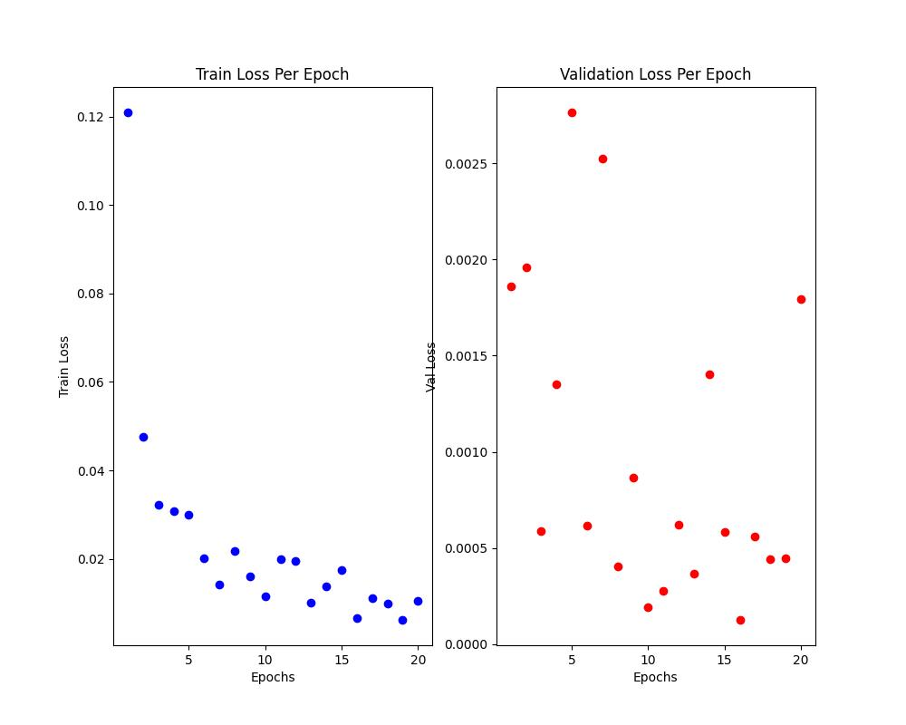

This is my first cnn preoject. Detects whether the person in the image is wearing a mask or not. Used vgg16 for transfer learning.

Here's the weights [file](https://drive.google.com/file/d/1ARj2hs0nBvgLDUXLXQ8BAb2l0UMf2mkm/view?usp=sharing).

